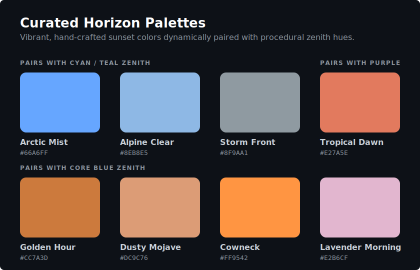

# Chill Flight

## Store metadata

<!-- Copy-ready metadata assets for store listings (Google Play Store, Apple App Store, and other distribution platforms). Storing these in version control ensures consistent description updates across platforms. -->

### Game title

<!-- Max 30 characters -->

Chill Flight

### Promotional text

<!-- Max 170 characters -->

Drift through endless, ever-changing skies to relaxing lofi beats.

### Description

<!-- Max 4,000 characters -->

A minimalist flight simulator in a procedurally generated world. Take flight and discover new horizons featuring:

- Dynamic weather
- Day-night cycles
- Diverse biomes
- Music by Purrple Cat

Have a chill flight.

### Keywords

<!-- Max 100 characters -->

flight,simulator,chill,lofi,relaxing,procedural,flying,airplanes

## Music

In-game radio features tracks by Purrple Cat (Used with permission/attribution).

## Biomes

The world is organized around a central coordinate system (0,0) where latitude (Z) and longitude (X) determine the primary environmental shifts.

| Biome             | Direction     | Latitude/Longitude          | Primary Characteristics                                                                                  |
| :---------------- | :------------ | :-------------------------- | :------------------------------------------------------------------------------------------------------- |
| **Temperate**     | Central       | Around (0, 0) (Center)      | Lush green plains and thick forests. High density of civilization (houses, barns, windmills).            |
| **Snowy**         | North         | Negative Z (North Latitude) | Frozen terrain, snow-capped mountains, icy water, pine forests, and frequent snow (~80% duty cycle).     |
| **Desert**        | South         | Positive Z (South Latitude) | Sandy dunes, reddish rock canyons, turquoise water, cactuses, and dead trees.                            |
| **Archipelago**   | East          | Positive X (East Longitude) | Coastlines flatten starting at 0.0 Longitude, leading to large island chains beyond 0.6 East (X > 3000). |
| **Lake District** | West          | Negative X (West Longitude) | Broad rolling hills, and vast inland lakes beyond X=-3000 (0.6 West).                                    |
| **Alien Zone**    | Far East/West | Beyond 10.0 East/West       | Warped, jagged alien topography with glowing neon seas and surreal colors.                               |

### 1. Temperate central (the heartland)

- **Location:** The area surrounding the equator (Z=0, 0.0 Latitude) and prime meridian (X=0, 0.0 Longitude).
- **Landscape:** A mix of rolling plains (#7CB342) and dense deciduous forests (#388E3C).
- **Key Features:**
  - **Structures:** Most common area for houses, barns, windmills, and monasteries.
  - **Vegetation:** Oak-like deciduous trees and bushes.
  - **Water:** Standard sky-blue water (#40C4FF) often featuring lily pads and piers.

### 2. The frozen north

- **Location:** Latitude 1.5+ North (Z < -7500). The deep frozen ocean starts around 4.0 North (Z < -20000).
- **Landscape:** Permanent snow cover (#FFFFFF) even at lower altitudes. White-tinted forests (#8BA192). Beyond 4.0 North, the ocean completely freezes over into a solid, jagged pack ice shelf (#A2B4BC) that rises out of the water.
- **Weather:** Frequent falling snow (~80% of the time) with occasional global breaks.
- **Key Features:**
  - **Mountain Range:** The "Northern Snowy Range" is located at approximately 2.0 North latitude (Z = -10000) and extends west from 1.0 West longitude (X = -5000). It features sharp, ridged peaks reaching altitudes up to 1600 units.
  - **Objects:** Snowmen, chimney smoke from houses, and frost-covered pine trees.
  - **Water:** Icy, pale blue water (#88CCFF) that transitions into solid, textured cyan ice (#6CA6A8) shelves and floating icebergs in the deep north.

### 3. The arid south (Arizona style)

- **Location:** Latitude 1.5+ South (Z > 7500).
- **Landscape:** Reddish-orange sand (#F4A460) and deep red canyon rock (#C24B2B).
- **Key Features:**
  - **Mountain Range:** The "Southern Arizona Range" is located at approximately 2.0 South latitude (Z = 10000) and extends west from 1.0 West longitude (X = -5000). It features broad mesas and rugged red-rock peaks.
  - **Vegetation:** Cactuses and skeletal "dead" trees.
  - **Water:** Deep turquoise tropical-style water (#00CED1).

### 4. Coastal islands (the east)

- **Location:** Longitude 0.0+ East (X > 0), transitioning to full ocean and islands beyond 0.6 East (X > 3000).
- **Landscape:** The land flattens significantly into sandy beaches before transitioning into the deep ocean.
- **Key Features:**
  - **Islands:** Island chains generated by domain-warped noise, featuring jagged coastlines and sharp, rugged mountain peaks rising from the sea.
  - **Vegetation:** Palm trees (#689F38) are found exclusively along these coasts.
  - **Maritime:** Sailboats.

### 5. The alien territory (the extremes)

- **Location:** The far extremes of the map, beyond 10.0 East (X > 50000) or 10.0 West (X < -50000).
- **Landscape:** Highly distorted, jagged crystalline peaks and surreal terrain generation.
- **Key Features:**
  - **Terrain Warping:** The far East features swirling, domain-warped ridges and basins, while the far West features massive geometric stepped plateaus and deep chasms.
  - **Colors:** Normal biomes are completely overtaken by vibrant, neon hues (cyan in the East, magenta in the West) that wash over the landscape.
  - **Seas:** The water transforms into a bright glowing liquid that bleeds smoothly onto the alien shorelines.

> [!NOTE]
> **Dynamic Coastlines:** Across all biomes, wherever the procedural water intersects with the land, the water's color dynamically blends into a white foam (#EEEEEE) to simulate natural shorelines and river banks.

## Atmosphere & Sky Colors

The game features a custom atmospheric scattering shader that dynamically handles transitions from day to sunset to night based on the sun's directional lighting, mie scattering, and a volumetric sun bloom effect.

To ensure every day looks unique while maintaining cinematic quality, the sky color engine utilizes a **Hybrid Palette System**:

- **Dynamic Zenith (Top Color):** The overarching sky color is procedurally generated each in-game day, offering infinite variations of cyan, deep blue, and twilight purple.
- **Curated Horizon (Bottom Color):** To prevent "muddy" or washed-out sunsets, the horizon color is strictly selected from a curated list of highly vibrant, hand-crafted sunset palettes (such as _Golden Hour_, _Arctic Mist_, or _Tropical Dawn_).
- **Smart Pairing:** The system automatically categorizes the procedural zenith color and pairs it with the most complementary curated horizon color, guaranteeing a stunning sunset every time.



## Weather

Weather is dynamic and procedural, tied to a global noise map and the player's latitude.

### Overcast skies

Overcast conditions occur when the procedural cloud noise exceeds a threshold (0.7) or during active precipitation.

- **Atmospheric effects**:
  - **Celestial visibility**: Stars and the Aurora Borealis become invisible. The Sun and Moon are dimmed.
  - **Lighting**: Sunlight and Moonlight intensity is reduced, shifting to ambient, diffuse lighting.
  - **Fog**: Base fog density increases, reducing visibility.
  - **Colors**: The sky and fog colors blend towards a dark, stormy gray.

### Storms and precipitation

Storms are triggered when the global cloud noise map reaches peak density (> 0.75). The type of precipitation depends on your latitude (Z coordinate):

- **The deep north** (Latitude > 2.0 North / Z < -10000): Storms intensify the already frequent snowfall.
- **The transition zone** (Latitude 1.0 to 2.0 North / Z between -5000 and -10000): Sleet (a mix of rain and snow).
- **Temperate and equator** (Latitude 2.0 South to 1.0 North / Z between 10000 and -5000): Full rain.
- **Desert border** (Latitude 2.0 to 3.0 South / Z between 10000 and 15000): Light rain that quickly dries up as you move further south.
- **Deep desert** (Latitude > 3.0 South / Z > 15000): Dry storms (the sky becomes overcast, but no rain falls).

### Atmospheric phenomena

- **Shooting stars**: Rare shooting stars streak across the clear night sky.
- **Rainbows**: Dynamic rainbows can appear when the sun shines shortly after a rainstorm.

### Permanent weather

- **Snowy biome**: Above Latitude 2.0 North, snow falls roughly 80% of the time, regardless of the storm noise map, with occasional brief breaks.

### Debug menu weather entries

The telemetry overlay provides real-time values for the weather system:

- **Overcast**: The current interpolated overcast value (0.0 to 1.0), determining cloud density and atmospheric effects.
- **Storm**: The raw noise value used to determine storm triggers. Values above 0.75 trigger precipitation.
- **Precip**: The calculated precipitation intensity (0.0 to 1.0), based on the maximum of normalized snow or rain opacity.
- **Zone**: The current climate zone based on latitude (Snow, Sleet, Rain, Dry Edge, Desert).
- **Snow α**: The visual opacity of the snow particle system (maxes out at 0.8).
- **Rain α**: The visual opacity of the rain particle system (maxes out at 0.5).
- **Fog**: The current density of the scene fog.

## Landmarks

These areas are layered on top of the primary biomes using noise-based "patches":

- **Autumn zones:** Large patches of burnt orange and red forests. These appear randomly in temperate areas, changing common trees into three varieties of autumn-foliage trees.
- **Cherry blossom groves:** Rare pink-tinted forests (#F8BBD0). These are the **only** places where Pagodas will spawn.
- **The equator river:** A massive, meandering river that runs primarily East-West around Z=0 (0.0 Latitude). It features fluctuating widths (80 to 300 units) and smooth, carved banks.
- **Grid rivers:** Smaller rivers running East-West every 3 degrees (15,000 units) North and South of the equator. These feature widths of 60 to 200 units and have unique snaking patterns determined by the world seed.
- **Volcano:** Located at approximately `1.0 South, 1.0 West` (X=-5000, Z=5000). This is a massive, procedural volcano featuring a wide base, ridged slopes, a caldera crater, and active visual elements like lava and smoke. The surrounding terrain is textured with dark basalt rock.
- **Montauk lighthouse:** Located at approximately `0.6 South, 1.2 East` (X=6000, Z=3000). This is a specific, guaranteed lighthouse landmark placed on the coast south-east of the spawn area, serving as a navigation point.
- **Rock Arch:** Located on the coast directly East of spawn at approximately `0.0 Latitude, 0.6 East` (X=3000, Z=0). A massive stone archway covered in grass, serving as a gateway to the islands.

## Liveries

The plane's color is deterministically chosen based on a hash of the player's unique UID. There are 8 available liveries:

- Sunset Coral
- Chill Teal
- Muted Sage
- Lofi Purple
- Ocean Slate
- Soft Sand
- Deep Rose
- Charcoal Black

You can force a specific livery using the `?palette=<index>` URL parameter (0-7).

## Wildlife

The world is populated with dynamic, procedural wildlife that adds life to the environment:

- **Geese:** Flocks of Canada geese fly in V-formations across the sky. They sleep and disappear at night, resuming their flight in the morning.
- **Hawks:** Solitary hawks glide on thermal currents, dynamically transitioning between flapping and soaring.
- **Seagulls:** Flocks of gulls circle over coastal regions and beaches.
- **Penguins:** Animated waddling penguins inhabit the icy terrain and floating icebergs of the deep north.

## Controls

Multiple control methods are supported: keyboard, mouse or trackpad, gamepad, and TV remote.

### Keyboard & mouse controls

#### General flight

- **Arrow up / down**: Control pitch (climb / dive).
- **Arrow left / right**: Control roll and turning.
- **Shift + arrow up / down**: Throttle control (increase / decrease speed).
- **Mouse wheel / trackpad scroll**: Smoothly adjust throttle (increase / decrease speed).
- **M**: Toggle minimap overlay.
- **L**: Toggle headlight.
- **Shift + A**: Toggle autopilot (automatically levels out and maintains heading/altitude). Manual steering input will auto-disable autopilot.
- **Escape**: Toggle pause menu.

#### Special maneuvers

- **Double-tap arrow up and hold**: Perform a steep climb.
- **Triple-tap arrow up and hold**: Perform a continuous loop.
- **Double-tap arrow down and hold**: Perform a steep dive.
- **Triple-tap arrow down**: Perform an Immelmann turn (loop followed by a half-roll).
- **Double-tap arrow left / right and hold**: Perform a barrel roll.

#### Free camera mode (if active)

- **Arrow keys**: Move camera horizontally.
- **Q / E**: Move camera vertically (down / up).
- **Shift**: Boost camera movement speed.

### Controller support

Full gamepad support mapped to standard flight controls.

- **Left analog stick**: Control pitch (up/down) and roll (left/right).
- **Right trigger (RT)**: Accelerate.
- **Left trigger (LT)**: Decelerate.
- **Left bumper (LB) / right bumper (RB)**: Control roll. Double-tap to trigger a barrel roll.
- **D-pad**: Mapped to arrow keys for menu navigation and alternative flight control.
- **Button A**: Select / enter.
- **Start / menu button**: Toggle pause menu.
- **Select / back button**: Toggle mobile action menu.

### TV remote support

The game is optimized for Android TV and similar devices using a standard remote control.

- **Arrow keys**: Navigate menus and control flight.
- **Enter / center button**: Select items or toggle pause (when playing).
- **Backspace / back button**: Toggle pause menu or go back.
- **Media play / pause**: Toggle pause menu.

### Touch & mobile controls

When playing on a touch device, specialized UI and controls become available:

- **Virtual joystick:** A premium, floating virtual joystick appears on screen for smooth, thumb-based flight control.
- **Control schemes:** A dedicated control scheme selector allows you to choose between virtual joystick, device tilt (gyroscope), or directional button steering.
- **Throttle:** A dedicated slider interface on the right side controls engine speed.

## Graphics & Settings

The game features automatic graphics preset detection that evaluates your device's hardware capabilities upon loading and seamlessly scales visual fidelity to ensure a smooth frame rate.

- **Presets (Low / Medium / High):** These presets automatically adjust render resolution, shadow maps, draw distances, and particle densities.
- **Manual override:** You can manually override the auto-detected graphics preset via the pause menu settings.

## URL Parameters

The game supports various URL query parameters for deep linking to specific locations, times, or configurations. Combine parameters using standard URL query syntax (e.g., `?lat=1.0N&lon=0.5W&tod=0.25`).

### Location and Orientation

- **`lat`**: Starting latitude (e.g., `1.0N`, `-1.0`).
- **`long`** or **`lon`**: Starting longitude (e.g., `0.5W`, `0.5`).
- **`alt`**: Starting altitude.
- **`heading`**: Starting compass heading in degrees (0 = North).
- **`pitch`**: Starting pitch angle in degrees.
- **`map`**: Load a specific pre-configured map location (e.g., `long-island`).

### Environment and Time

- **`tod`**: Time of day (value between `0.0` and `1.0`, where 0 is midnight and 0.5 is solar noon).
- **`timeSpeed`**: Speed multiplier for the day/night cycle (set to `0` to lock the time of day).
- **`seed`**: Integer world seed for procedural terrain generation.
- **`theme`**: The visual theme to load (e.g., `standard`).
- **`cloud`**: Set to `none` to disable procedural clouds.
- **`objects`**: Set to `none` to disable all spawned objects (trees, houses, etc.).

### Camera and System

- **`freecam`** or **`freeCamera`**: Set to `true` to start immediately in the free camera mode (bypassing cinematic intros).
- **`x`, `y`, `z`**: Starting exact XYZ coordinates for the camera (useful for exact freecam sharing).
- **`palette`**: Force a specific plane color by providing a palette index.
- **`scale`**: Override the overall visual scaling factor (default `1.0`).

## Development

### Prerequisites

Ensure you have [Node.js](https://nodejs.org/) installed.

### Installation

Clone the repository and install the required dependencies:

```bash
npm install
```

### Running locally

To launch the local development server with Hot Module Replacement (HMR):

```bash
npm run dev
```

Once started, open `http://localhost:5173` in your browser.

> [!NOTE]
> During development, classic script files (e.g., `game.js`, `airplane.js`) are served unbundled to maintain original file structure mappings, enabling effortless hot-reloading and exact console log line numbers.

### Model debug page

A debug directory is available during development at `/debug.html` (e.g., `http://localhost:5173/debug.html`), which links to standalone viewers like the model viewer (`/debug-models.html`). These pages allow you to inspect and preview in-game geometries and structures in isolation, making it easy to tweak vertices, test materials, and verify rotations before adding them to the procedural world.

### Production build

To optimize, minify, and bundle the entire codebase for deployment:

```bash
npm run build
```

This builds the optimized code into the `docs/` folder (which is hosted directly on GitHub Pages):

- Third-party dependencies (`three`, `@sentry/browser`) are compiled into a shared chunk.
- Classic legacy scripts are concatenated, minified, and outputted into a single, high-performance `docs/game-bundle.js` script.

### Previewing production build

Since the development server (`npm run dev`) serves files dynamically from source, relative asset paths (like those requested by query parameters) will not resolve correctly when navigating directly to folders inside the dev environment.

To test the actual, fully-bundled production build locally exactly as it will run in production:

```bash
npm run preview
```

Once started, open `http://localhost:4173` in your browser. This spins up a lightweight server hosting your compiled `docs/` directory. You can test production features and parameters (such as `http://localhost:4173/?map=long-island`) flawlessly!

### Version management

The application's version number is managed using a single-source-of-truth system centered around `package.json`.

To release a new production version:

- **Release builds (`npm run release`)**: Running this command automatically bumps the patch version of the application (e.g., `0.8.7` -> `0.8.8`), builds the optimized frontend assets, and packages them inside `docs/` in a single step!

For local development compiles (including wrapper scripts like `npm run ios` and `npm run android`), standard compilation is done via `npm run build`, which compiles the assets **without** modifying any version numbers.

If you need to manually perform a custom version bump (e.g., for major or minor releases):

1. **Automated CLI**: Run the standard npm command to bump the version without creating git tags:

   ```bash
   npm version <new-version> --no-git-tag-version
   ```

   _(e.g., `npm version 0.9.0 --no-git-tag-version`)_
   This automatically updates both `package.json` and `package-lock.json`.

2. **Manual Update**: Alternatively, you can directly edit the `"version"` field in `package.json`. The next time you run any package operation, npm will automatically keep `package-lock.json` in sync.

When a build is run, the bundler reads the version and injects it dynamically into the in-game UI. The desktop build (Tauri) is also linked and will update automatically.

### Native mobile app development (Capacitor)

This project uses **Capacitor** to build fully native apps for iOS and Android.

#### Build and run iOS app

To compile the web assets, sync with the iOS project, copy multiplayer configuration files, and open Xcode:

```bash
npm run ios
```

#### Build and run Android app

To compile the web assets, sync with the Android project, copy Firebase configurations, and open Android Studio:

```bash
npm run android
```

### Desktop app development (Tauri)

This project uses **Tauri** to build lightweight, native desktop apps for macOS, Windows, and Linux.

#### Run desktop app in development

To run the application locally in a native desktop window with hot-reloading:

```bash
npx tauri dev
```

#### Build desktop app for production

To package and compile the production desktop application:

```bash
npm run build && npx tauri build
```

This compiles the web assets into `docs/` and triggers the Rust compiler to bundle them into a native desktop installer.
