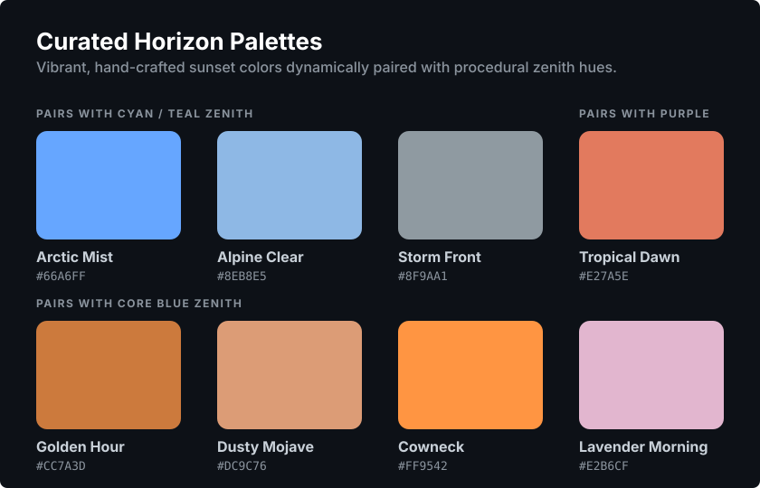

# Chill Flight

## Store metadata

<!-- Copy-ready metadata assets for store listings (Google Play Store, Apple App Store, and other distribution platforms). Storing these in version control ensures consistent description updates across platforms. -->

### Game title

<!-- Max 30 characters -->

Chill Flight

### Description

<!-- Max 4,000 characters -->

A minimalist flight simulator set in an endless, ever-changing world.

Drift along to lofi beats as you explore diverse landscapes featuring dynamic weather, day-night cycles, and biomes that shift with each journey.

Music by Purrple Cat.

Have a chill flight.

### Keywords

<!-- Max 100 characters -->

flight,simulator,chill,lofi,relaxing,procedural,exploration,ambient

## Music

In-game radio features tracks by Purrple Cat (Used with permission/attribution).

To start without music (say, on a train), tap the speaker button under Start on the title screen. The choice is saved: later visits skip the title screen and start silently. Music can be turned back on in settings.

## Biomes

The world is organized around a central coordinate system (0,0) where latitude (Z) and longitude (X) determine the primary environmental shifts.

| Biome             | Direction     | Latitude/Longitude          | Primary Characteristics                                                                                                       |
| :---------------- | :------------ | :-------------------------- | :---------------------------------------------------------------------------------------------------------------------------- |
| **Temperate**     | Central       | Around (0, 0) (Center)      | Lush green plains and thick forests. High density of civilization (houses, barns, windmills).                                 |
| **Snowy**         | North         | Negative Z (North Latitude) | Frozen terrain, snow-capped mountains, icy water, pine forests, and frequent snow (~80% duty cycle).                          |
| **Desert**        | South         | Positive Z (South Latitude) | Sandy dunes, reddish rock canyons, turquoise water, cactuses, and dead trees.                                                 |
| **Archipelago**   | East          | Positive X (East Longitude) | Coastlines flatten starting at 0.0 Longitude, leading to large island chains beyond 0.6 East (X > 3000).                      |
| **Lake District** | West          | Negative X (West Longitude) | Long lakes filling the valleys between hills and ranges, west of 0.7 West (X < -3500), within about 2 degrees of the equator. |
| **Alien Zone**    | Far East/West | Beyond 10.0 East/West       | Warped, jagged alien topography with glowing neon seas and surreal colors.                                                    |

### 1. Temperate central (the heartland)

- **Location:** The area surrounding the equator (Z=0, 0.0 Latitude) and prime meridian (X=0, 0.0 Longitude).
- **Landscape:** A mix of rolling plains (#7CB342) and dense deciduous forests (#388E3C).
- **Key Features:**
  - **Structures:** Most common area for houses, barns, windmills, and monasteries.
  - **Trees in the wind:** Tree canopies sway gently in slow, uneven gusts, more in overcast weather, all leaning the same way downwind (`addWindSway` in `terrain-geometry.js`).
  - **Vegetation:** Oak-like deciduous trees and bushes.
  - **Water:** Standard sky-blue water (#40C4FF) often featuring lily pads and piers.

### Lake district (the west)

- **Location:** West of 0.7 West (X < -3500), fading in over 0.8 degrees, between about 1.8 North and 1.8 South (Z between -9000 and 9000, fading out by 2.6 degrees).
- **Landscape:** The valley floors are flooded, so lakes take the shape of the valleys: long lakes fingering between the hills and ranges, with the land around them easing down to gentle shores. How high the water reaches varies slowly across the region, so there are lake-filled districts and drier ones, different for each world seed. Rivers and the west coast highway run through (`VALLEY LAKES` in `getElevation`, `chill-flight-logic.js`).
- **Islands:** Some larger lakes have wooded islands, which rise at most to the height of the land around the lake.

### 2. The frozen north

- **Location:** Snow starts around Latitude 1.5 North (Z = -7500) and deepens gradually to full cover by 2.5 North (Z = -12500). The snowline on mountains comes down gradually from 1,150 units near the equator to 750 by 1.0 North, so the first northern range is green and rocky with snow-capped peaks, and then with the snow cover down to the valleys. Ground, water ice, trees and snowfall all use one snow cover function (`snowFactorAt` in `chill-flight-logic.js`). The deep frozen ocean starts around 4.0 North (Z < -20000).
- **Landscape:** Permanent snow cover (#FFFFFF) even at lower altitudes. White-tinted forests (#8BA192). Beyond 4.0 North, the ocean completely freezes over into a solid, jagged pack ice shelf (#A2B4BC) that rises out of the water. In bright midday sun, snow and ice are dimmed slightly and shifted cool (`uSnowExposure`) so their shading stays visible instead of washing out to flat white.
- **Weather:** Frequent falling snow (~80% of the time) with occasional global breaks.
- **Key Features:**
  - **Mountain ranges:** The first range north always rises around 1.0 North (Z = -5000), south of the snow, so it's green with snow-capped peaks; ranges further north vary by world seed and are snowbound. Ranges start at 0.5 West (X = -2500) and reach full height by 1.5 West (X = -7500), with sharp, ridged peaks up to 1600 units.
  - **Objects:** Snowmen, chimney smoke from houses, and frost-covered pine trees.
  - **Water:** Icy, pale blue water (#88CCFF) that transitions into solid, textured cyan ice (#6CA6A8) shelves and floating icebergs in the deep north.

### 3. The arid south (Arizona style)

- **Location:** Latitude 1.5+ South (Z > 7500).
- **Landscape:** Reddish-orange sand (#F4A460) and deep red canyon rock (#C24B2B).
- **Key Features:**
  - **Mountain ranges:** The first range south always rises around 1.0 South (Z = 5000), still green. Ranges further south vary by world seed; in the desert (beyond about 2.3 South, Z = 11500) they become broad mesas and rugged red-rock peaks.
  - **Vegetation:** Cactuses and skeletal "dead" trees.
  - **Water:** Deep turquoise tropical-style water (#00CED1).

### 4. Coastal islands (the east)

- **Location:** Longitude 0.0+ East (X > 0), transitioning to full ocean and islands beyond 0.6 East (X > 3000).
- **Landscape:** The land flattens significantly into sandy beaches before transitioning into the deep ocean.
- **Key Features:**
  - **Islands:** Island chains generated by domain-warped noise, featuring jagged coastlines and sharp, rugged mountain peaks rising from the sea.
  - **Vegetation:** Palm trees (#689F38) are found exclusively along these coasts.
  - **Maritime:** Sailboats.

### 5. The alien territory (the extremes)

- **Location:** The far extremes of the map, beyond 10.0 East (X > 50000) or 10.0 West (X < -50000).
- **Landscape:** Highly distorted, jagged crystalline peaks and surreal terrain generation.
- **Key Features:**
  - **Terrain Warping:** The far East features swirling, domain-warped ridges and basins, while the far West features massive geometric stepped plateaus and deep chasms.
  - **Colors:** Normal biomes are completely overtaken by vibrant, neon hues (cyan in the East, magenta in the West) that wash over the landscape.
  - **Seas:** The water transforms into a bright glowing liquid that bleeds smoothly onto the alien shorelines.

> [!NOTE]
> **Water surface:** Water mirrors the sky with a Fresnel reflection (looking down you see the water, toward the horizon you see the sky's colors), and the sun lays a glitter path across it from the horizon toward the viewer, golden at low sun, with sparkles up close. At night the moon lays a silver path the same way, visible even for a thin crescent. Open water (about 10 units deep) is opaque deep blue; shallows around islands and shores turn turquoise. The water's depth is sampled per pixel from each chunk's terrain height grid (a small texture per water chunk), so shallows and foam follow the shore in smooth curves; color and transparency use that depth softened over about 200 units for a gradual blend, and the swell calms in shallow water. A band of foam lines every shore at the same width (its distance to shore is estimated from how quickly the depth changes), with rings that roll toward the beach. The swell is three waves in different directions, so the surface doesn't read as regular stripes.

> **Dynamic Coastlines:** Across all biomes, wherever the procedural water intersects with the land, the water's color dynamically blends into a white foam (#EEEEEE) to simulate natural shorelines and river banks.

## Atmosphere & Sky Colors

The game features a custom atmospheric scattering shader that dynamically handles transitions from day to sunset to night based on the sun's directional lighting, mie scattering, and a volumetric sun bloom effect. Around sunrise and sunset the sky also varies around the compass: warm and bright toward the sun, cooler away from it, with the earth's shadow (a blue band) and the pink "belt of Venus" low in the sky opposite the sun in the minutes around sunset and sunrise (sun within about 3 degrees above to 9 below the horizon), while the zenith keeps the palette's deeper color. The sky dome, the directional fog and water reflections all compute the sky with one shared function (`SKY_COLOR_GLSL` in `constants.js`), so distant land fades into exactly the sky behind it. Clouds are lit for the time of day too: at sunrise and sunset, clouds toward the sun glow gold, clouds opposite it catch pink light, and their shaded sides take the sky's cool blue-violet. In the minutes after sunset (the afterglow) they glow coral and ember red toward the sunset and pink opposite, then dim to a moonlit grey-blue for the night, silver near the moon, which has a soft halo (brighter toward full moon; `moonlightUniforms` in `constants.js`). The water reflects the clouds at the same positions (the cloud noise and lighting are shared GLSL, `CLOUD_GLSL` in `constants.js`).

To ensure every day looks unique while maintaining cinematic quality, the sky color engine utilizes a **Hybrid Palette System**:

- **Dynamic Zenith (Top Color):** The overarching sky color is procedurally generated each in-game day, offering infinite variations of cyan, deep blue, and twilight purple.
- **Curated Horizon (Bottom Color):** To prevent "muddy" or washed-out sunsets, the horizon color is strictly selected from a curated list of highly vibrant, hand-crafted sunset palettes (such as _Golden Hour_, _Arctic Mist_, or _Tropical Dawn_).
- **Smart Pairing:** The system automatically categorizes the procedural zenith color and pairs it with the most complementary curated horizon color, guaranteeing a stunning sunset every time.



## Weather

Weather is dynamic and procedural, tied to a global noise map and the player's latitude.

### Overcast skies

Overcast conditions occur when the procedural cloud noise exceeds a threshold (0.7) or during active precipitation.

- **Atmospheric effects**:
  - **Celestial visibility**: Stars and the Aurora Borealis become invisible. The Sun and Moon are dimmed.
  - **Lighting**: Sunlight and Moonlight intensity is reduced, shifting to ambient, diffuse lighting.
  - **Fog**: Fog thickens with cloud cover, reducing visibility (see [Fog](#fog)).
  - **Colors**: The sky and fog colors blend towards a dark, stormy gray.

### Storms and precipitation

Storms are triggered when the global cloud noise map reaches peak density (> 0.82). The type of precipitation depends on your latitude (Z coordinate):

- **The deep north** (Latitude > 2.5 North / Z < -12500): Storms intensify the already frequent snowfall.
- **The transition zone** (Latitude 1.5 to 2.5 North / Z between -7500 and -12500): Sleet (a mix of rain and snow).
- **Temperate and equator** (Latitude 2.0 South to 1.5 North / Z between 10000 and -7500): Full rain.
- **Desert border** (Latitude 2.0 to 3.0 South / Z between 10000 and 15000): Light rain that quickly dries up as you move further south.
- **Deep desert** (Latitude > 3.0 South / Z > 15000): Dry storms (the sky becomes overcast, but no rain falls).

### Fog

Fog density follows the conditions; the thickest applicable condition wins:

- **Clear skies**: Light fog, so distant mountains stay crisp on sunny days.
- **Morning fog**: Builds from 04:00, is thickest from about 05:30 to 07:30, and burns off by 10:00.
- **Clouds**: Fog thickens as cloud cover increases.
- **Rain and snow**: The thickest fog, closing in the horizon.
- **After rain**: Mist lingers after precipitation stops and clears over about two minutes.

The values live in `FOG` in `chill-flight-logic.js`. The debug menu's clear-sky fog slider overrides the clear-sky density; the other conditions still thicken it from there.

### Atmospheric phenomena

- **Shooting stars**: Rare shooting stars streak across the clear night sky.
- **Rainbows**: Dynamic rainbows can appear when the sun shines shortly after a rainstorm.

### Permanent weather

- **Snowy biome**: From Latitude 1.5 North, and heavier further north, snow falls roughly 80% of the time, regardless of the storm noise map, with occasional brief breaks.

### Debug menu weather entries

The telemetry overlay provides real-time values for the weather system:

- **Overcast**: The current interpolated overcast value (0.0 to 1.0), determining cloud density and atmospheric effects.
- **Storm**: The raw noise value used to determine storm triggers. Values above 0.75 trigger precipitation.
- **Precip**: The calculated precipitation intensity (0.0 to 1.0), based on the maximum of normalized snow or rain opacity.
- **Zone**: The current climate zone based on latitude (Snow, Sleet, Rain, Dry Edge, Desert).
- **Snow α**: The visual opacity of the snow particle system (maxes out at 0.8).
- **Rain α**: The visual opacity of the rain particle system (maxes out at 0.5).
- **Fog**: The current density of the scene fog.

## Landmarks

These areas are layered on top of the primary biomes using noise-based "patches":

- **Autumn zones:** Large patches of burnt orange and red forests. These appear randomly in temperate areas, changing common trees into three varieties of autumn-foliage trees.
- **Cherry blossom groves:** Rare pink-tinted forests (#F8BBD0). These are the **only** places where Pagodas will spawn.
- **The equator river:** A massive, meandering river that runs primarily East-West around Z=0 (0.0 Latitude). It features fluctuating widths (80 to 300 units) and smooth, carved banks.
- **Grid rivers:** Smaller rivers running East-West every 3 degrees (15,000 units) North and South of the equator. These feature widths of 60 to 200 units and have unique snaking patterns determined by the world seed.
- **Estuaries and tributaries:** Rivers widen over the last 6 km before the east coast (1.0 West to 0.2 East) into broad estuaries, up to 4.5 times as wide at the mouth. Inland, side streams join them from the north or south at irregular, seed-chosen spots (up to one per 7 km of river), running 2.5 to 5 km, meandering and narrowing toward their source, and stopping at the foot of mountains. All water sits at sea level, so there are no waterfalls.
- **West coast highway:** A continuous, wide geometric highway (60 units wide) that snakes North-South along the west coast (around 1.5 West / X=-7500). When crossing water or plunging into valleys, it seamlessly transforms into an elevated viaduct featuring an aerodynamic trapezoidal box girder, concrete parapets, sculpted hammerhead pier caps, and faceted pylons with foundation caissons spaced every 120 units. It maintains a strict 60-unit minimum clearance above water level, providing generous, wide bays to fly underneath.
- **Volcano:** Located at approximately `1.0 South, 1.0 West` (X=-5000, Z=5000). This is a massive, procedural volcano featuring a wide base, ridged slopes, a caldera crater, and active visual elements like lava and smoke. The surrounding terrain is textured with dark basalt rock.
- **Montauk lighthouse:** Located at approximately `0.6 South, 1.2 East` (X=6000, Z=3000). This is a specific, guaranteed lighthouse landmark placed on the coast south-east of the spawn area, serving as a navigation point.
- **Rock Arch:** Located on the coast directly East of spawn at approximately `0.0 Latitude, 0.6 East` (X=3000, Z=0). A massive stone archway covered in grass, serving as a gateway to the islands.

## Liveries

The plane's color is deterministically chosen based on a hash of the player's unique UID. There are 8 available liveries:

- Sunset Coral
- Chill Teal
- Muted Sage
- Lofi Purple
- Ocean Slate
- Soft Sand
- Deep Rose
- Charcoal Black

You can force a specific livery using the `?palette=<index>` URL parameter (0-7).

## Wildlife

The world is populated with dynamic, procedural wildlife that adds life to the environment:

- **Geese:** Flocks of Canada geese fly in V-formations across the sky. They sleep and disappear at night, resuming their flight in the morning.
- **Hawks:** Solitary hawks glide on thermal currents, dynamically transitioning between flapping and soaring.
- **Seagulls:** Flocks of gulls circle over coastal regions and beaches.
- **Penguins:** Animated waddling penguins inhabit the icy terrain and floating icebergs of the deep north.

## Controls

Multiple control methods are supported: keyboard, mouse or trackpad, and gamepad.

### Keyboard & mouse controls

#### General flight

- **Arrow up / down**: Control pitch (climb / dive).
- **Arrow left / right**: Control roll and turning.
- **Shift + arrow up / down**: Throttle control (increase / decrease speed).
- **Mouse wheel / trackpad scroll**: Smoothly adjust throttle (increase / decrease speed).
- **M**: Toggle minimap overlay (or close fullscreen map if open).
- **L**: Toggle headlight.
- **V**: Cycle active aircraft (switch between Classic monoplane, vintage Biplane, Glider, and Twin engine transport).
- **Shift + A**: Toggle autopilot (automatically levels out and maintains heading/altitude). Manual steering input will auto-disable autopilot.
- **Escape**: Toggle pause menu (or close fullscreen map if open).
- **Fullscreen world map**: Open via the 🗺️ Map button in the pause menu. Drag with mouse to pan, scroll wheel or `+` / `−` keys to zoom, and click 🎯 to center on plane. The map and the minimap color the land by height (hillshaded) and by region: the snowy north, the sandy and red-rock south, and the alien lands (cyan in the east, magenta in the west), using the same noise and thresholds as the terrain (`tintForRegion` in `minimap.js`).

#### Special maneuvers

- **Double-tap arrow up and hold**: Perform a steep climb.
- **Triple-tap arrow up and hold**: Perform a continuous loop.
- **Double-tap arrow down and hold**: Perform a steep dive.
- **Triple-tap arrow down**: Perform an Immelmann turn (loop followed by a half-roll).
- **Double-tap arrow left / right and hold**: Perform a barrel roll.

#### Free camera mode (if active)

- **Arrow keys**: Move camera horizontally.
- **Q / E**: Move camera vertically (down / up).
- **Shift**: Boost camera movement speed.

### Controller support

Full gamepad support mapped to standard flight controls.

- **Left analog stick**: Control pitch (up/down) and roll (left/right).
- **Right trigger (RT)**: Accelerate.
- **Left trigger (LT)**: Decelerate.
- **Left bumper (LB) / right bumper (RB)**: Control roll. Double-tap to trigger a barrel roll.
- **D-pad**: Mapped to arrow keys for menu navigation and alternative flight control.
- **Button A**: Select / enter.
- **Start / menu button**: Toggle pause menu.
- **Select / back button**: Toggle mobile action menu.

### Touch & mobile controls

When playing on a touch device, specialized UI and controls become available:

- **Virtual joystick:** A premium, floating virtual joystick appears on screen for smooth, thumb-based flight control.
- **Control schemes:** A dedicated control scheme selector allows you to choose between virtual joystick, device tilt (gyroscope), or directional button steering.
- **Throttle:** A dedicated slider interface on the right side controls engine speed.
- **Fullscreen world map:** Tap the 🗺️ Map button in the pause menu to open the full screen map. Press and hold / drag to pan across the world, pinch with two fingers to zoom in and out, double-tap to zoom in, and tap 🎯 to re-center on your plane.

### WebXR & VR headset support

Chill Flight supports immersive virtual reality on devices such as the Meta Quest 2 via the Meta Quest Browser or any WebXR-compliant browser:

- **Enter VR:** An opt-in "VR" button appears in the pause menu and initial splash screen when a compatible WebXR VR headset is detected.
- **Head tracking:** Full 6DoF head tracking allows you to look around freely from either the follow chase view or cockpit first-person view.
- **Touch controllers:** Use the right analog thumbstick for pitch and roll steering, right trigger to accelerate, and left trigger to decelerate.
- **In-game pause menu:** Press the left controller **Y** button or click either thumbstick to bring up the 3D in-world pause menu. Select options using the laser pointer trigger, or press **A** to resume flight and **B** to exit VR.
- **Performance:** Automatically enables fixed foveated rendering and unlocks high display refresh rates (72 Hz / 90 Hz).

## Graphics & settings

The game features automatic graphics preset detection that evaluates your device's hardware capabilities upon loading and seamlessly scales visual fidelity to ensure a smooth frame rate.

- **Presets (low / mid / high / ultra):** These presets automatically adjust render resolution, shadow maps, draw distances, and mesh densities. Mid and up also draw the distant terrain ring (see below); low fades the land into the sky at the draw distance instead.
- **Manual override:** You can manually override the auto-detected graphics preset via the pause menu settings.

| Preset    | Chunk radius | Active chunk grid          | Draw distance | Mesh density (`SEGMENTS`) | Triangles per chunk | Resolution scale          | Visual effects  |
| :-------- | :----------- | :------------------------- | :------------ | :------------------------ | :------------------ | :------------------------ | :-------------- |
| **Low**   | 4 chunks     | 9 × 9 (up to 81 chunks)    | 6,000 units   | 20                        | 800                 | Fixed 0.5×                | Off (optimized) |
| **Mid**   | 6 chunks     | 13 × 13 (up to 169 chunks) | 9,000 units   | 30                        | 1,800               | Up to 1.5× (`dpr × 0.75`) | Full            |
| **High**  | 7 chunks     | 15 × 15 (up to 225 chunks) | 10,500 units  | 40                        | 3,200               | Up to 1.5× (`dpr`)        | Full            |
| **Ultra** | 8 chunks     | 17 × 17 (up to 289 chunks) | 12,000 units  | 50                        | 5,000               | Up to 2.0× (`dpr`)        | Full            |

_Note: Full visual effects include real-time shadows, transparent water and clouds, and procedural sky clouds. The low preset disables these to minimize overdraw and maximize frame rate on lower-end devices._

### Dynamic performance scaling

In addition to static presets, the game includes a runtime `DynamicPerformanceMonitor` that continuously tracks a 30-frame rolling average frame time and smoothly adjusts multiple graphics subsystems in tandem.

Rather than choosing between reducing prop detail or lowering resolution, **LOD scaling and dynamic resolution scaling (DRS) operate simultaneously**. Because web performance can be constrained either by CPU draw calls / vertex transformation or by GPU fragment fill rate, adjusting both parameters across synchronized tiers ensures frame recovery regardless of whether the bottleneck is CPU- or GPU-bound.

#### Tiered scaling thresholds

Adjustments occur across four frame-time thresholds with a 30-frame hysteresis cooldown between adjustments:

| Load state            | Frame time threshold | Effective FPS | LOD multiplier           | DRS resolution multiplier | Shadow update cadence | Terrain chunk budget |
| :-------------------- | :------------------- | :------------ | :----------------------- | :------------------------ | :-------------------- | :------------------- |
| **Normal / recovery** | ≤ 17.50 ms           | ≥ 57 FPS      | Recovers +0.1 (max 1.0×) | Recovers +0.05 (max 1.0×) | Every frame (1/1)     | 4.0 ms / frame       |
| **Slight overload**   | > 20.00 ms           | < 50 FPS      | −0.1 step (floor 0.6×)   | Unchanged (1.0×)          | Every 2nd frame (1/2) | 3.0 ms / frame       |
| **Moderate overload** | > 25.00 ms           | < 40 FPS      | −0.1 step (floor 0.4×)   | −0.05 step (floor 0.8×)   | Every 3rd frame (1/3) | 2.0 ms / frame       |
| **Severe overload**   | > 33.33 ms           | < 30 FPS      | −0.2 step (floor 0.2×)   | −0.10 step (floor 0.8×)   | Every 4th frame (1/4) | 1.0 ms / frame       |

#### Subsystem behaviors

- **Dynamic resolution scaling (DRS):** Scales the WebGL renderer's `pixelRatio` relative to the graphics preset's base pixel ratio down to a floor of 80% under moderate or severe load (< 40 FPS). This directly reduces fragment shading load and screen-space overdraw while maintaining visual fidelity above native 1:1 screen resolution on high-DPI displays.
- **LOD distance scaling:** Multiplies the prop visibility distance (base 4,200 units) down to a floor of 20% (840 units). Distant houses, chimneys, and piers are culled, significantly reducing vertex counts and draw calls.
- **Adaptive chunk budget:** Terrain workers compute each chunk's heights, colors, and prop placements; the main thread then builds the chunk's meshes from that result within an adaptive per-frame time allowance (`processChunkQueue` in `terrain-chunks.js`). Under normal conditions, chunk building runs up to 4.0 ms per frame, dropping to 1.0 ms under severe load to eliminate stutter during flight. A chunk is generated entirely on the main thread only if workers are unavailable or its worker job failed.
  - _Boot override:_ During the initial startup loading screen (`isPaused && !isIntroTransitionActive`), the chunk budget is temporarily boosted to 33.0 ms per frame so the initial world geometry generates almost instantaneously.
- **Shadow throttling and night culling:**
  - _Dynamic throttling:_ Directional sun shadow map rendering scales down from every frame (cadence 1) to every 2nd, 3rd, or 4th frame under load, amortizing shadow pass render costs.
  - _Night culling:_ When the sun dips below the horizon (`dayFactor < 0.05`), shadows are completely disabled (`shadowCadence = 0`, `renderer.shadowMap.needsUpdate = false`), saving the entire shadow pass when shadows are visually imperceptible.
  - _Preset disable:_ Shadows are also completely disabled when using the Low graphics preset.
- **Telemetry overlay:** In debug mode (`?debug`), the debug panel displays real-time telemetry including average frame time (`Avg ms`), DRS multiplier (`DRS mult`), shadow cadence (`Shadow cad`), active chunk budget (`Chunk budget`), and loaded prop chunk counts.

### Rendering optimizations

These keep draw calls, triangles, and per-frame work down; keep them in mind when adding new props or materials:

- **Culled chunk props:** Each chunk's instanced props (houses, rocks, boats, etc.) get a bounding sphere around their own instances, padded 160 units for boats drifting and smoke rising after the build, so three.js skips those outside the camera or shadow view. Pooled instanced meshes would otherwise keep stale automatic bounds, so these spheres are set when a chunk is built (`enableChunkInstanceCulling` in `terrain-chunks.js`). A sphere around the whole chunk let about half of these draws through.
- **Tiled world-wide instances:** Trees and other world-wide props are instanced per type in tiles of 4 × 4 chunks, so tiles outside the view (including everything behind the plane) aren't drawn (`GlobalInstanceManager`).
- **Distant terrain ring:** Beyond the draw distance, coarse terrain continues out to 27 km (`far-terrain.js`), so distant islands, coasts and mountain ranges show on the horizon. It uses the same generator as the near chunks (`terrain-gen.js`, on the terrain workers) with 9,000-unit cells on a ~333-unit grid and no props, about 40 draw calls. Far cells are only requested once the near chunk queue is empty, and they rebuild only when the plane enters a new cell. Inside the draw distance the ring sinks below the ground so the near chunks cover it (a vertex offset rather than a pixel discard, which keeps early depth rejection), and it fades into the shared sky color with distance. Sea areas are flattened and shaded as water reflecting the sky.
- **Shadow coverage:** The sun's 2048×2048 shadow map covers a 4,096-unit square that sits 1,400 units ahead of the plane along the camera's heading (`SHADOW_LOOK_AHEAD` in `game-loop.js`), so shadows reach about 3.5 km ahead. Shadows fade out over the outer 10% of the square (patched into three.js's shadow shader in `sky.js`), so they grow in gradually instead of popping in at its edge.
- **Tree shadows near the plane only:** The sun's shadow volume reaches about 4,500 units from the plane, so only trees within 4 chunks cast shadows, through shadow-only meshes that draw nothing on screen.
- **Distant and shadow detail:** Beyond 3 chunks (~4.5 km), rounded tree canopies, palm trunks, and cacti draw as simple shapes fitted to the original model's bounds, and bushes and snowmen aren't drawn. Bushes and rounded canopies also cast shadows with those simple shapes: the shadow map is 2 units per texel, so their detail doesn't show in shadows. Palm fronds cast with a version without their notches (216 triangles instead of 504), which keeps their star-shaped shadow. See `setFarGeometry` and `setShadowGeometry` in `terrain-chunks.js`.
- **Fog color per vertex:** Terrain, water and the distant ring fade into the sky's color with distance. Computing that color for every pixel was the costliest part of their shaders (about 1 ms per frame on an M1 MacBook Air at sea), so they compute its smooth parts per vertex and only the sun's narrow core per pixel (`FOG_SKY_VERTEX_GLSL` in `constants.js`). Props keep it per pixel: they have more vertices than pixels on screen.
- **Stable shader programs:** three.js re-derives a material's shader program whenever it is marked changed or used by a different kind of object. Avoid sharing one material between instanced and regular meshes, and give transparent double-sided materials `forceSinglePass: true` when their look allows it (three.js otherwise draws them in two passes and flags them changed each time). Instanced meshes use their own shadow depth materials for the same reason (`useInstancedDepthMaterial`).

## URL parameters

The game supports various URL query parameters for deep linking to specific locations, times, or configurations. Combine parameters using standard URL query syntax (e.g., `?lat=1.0N&lon=0.5W&tod=0.25`).

### Location and orientation

- **`lat`**: Starting latitude (e.g., `1.0N`, `-1.0`).
- **`long`** or **`lon`**: Starting longitude (e.g., `0.5W`, `0.5`).
- **`alt`**: Starting altitude.
- **`heading`**: Starting compass heading in degrees (0 = North).
- **`pitch`**: Starting pitch angle in degrees.
- **`speed`**: Starting flight speed multiplier (e.g., `1.0`, `2.0`, `0`).
- **`plane`** or **`vehicle`**: Initial aircraft model (`classic` for the standard monoplane, `biplane` for the vintage biplane, `glider`, or `twin`).
- **`map`**: Load a specific pre-configured map location (e.g., `long-island`).

### Environment and time

- **`tod`**: Time of day (value between `0.0` and `1.0`, where 0 is midnight and 0.5 is solar noon).
- **`timeSpeed`**: Speed multiplier for the day/night cycle (set to `0` to lock the time of day).
- **`seed`**: Integer world seed for procedural terrain generation.
- **`theme`**: The visual theme to load (e.g., `standard`).
- **`islandType`** or **`island`**: Force Eastern Islands geographic archetype (options: `auto`, `karst`, `caldera`, `atoll`).
- **`cloud`** (or **`clouds`**, **`cloudCover`**, **`overcast`**): Cloud cover density or mode (options: `auto` for procedural weather noise, `none` or `false` to disable clouds, `clear` for 0.0, `scattered` for 0.3, `broken` for 0.6, `overcast` for 1.0, or any float between `0.0` and `1.0`).
- **`cloudHeight`** (or **`cloudAlt`**): Altitude in meters/units for the procedural cloud deck (default `3000`).
- **`cloudSpeed`**: Speed multiplier for cloud drift animation (default `1.0`, set to `0` to freeze cloud movement).
- **`weather`**: Force weather conditions (options: `auto`, `none` or `clear`, `snow`, `rain`).
- **`palette`**: Force a specific sky palette preset seed (e.g., `42`) or custom zenith,horizon[,day] hex colors (e.g., `1a2b3c,ff7e67` or `1a2b3c,ff7e67,4ca1f0`).
- **`zenith`**, **`horizon`**, & **`day`** (or **`dayBlue`**): Force custom sky zenith, horizon, and day blue hex colors (e.g., `zenith=1a2b3c&horizon=ff7e67&day=4ca1f0` or `day=4ca1f0`).
- **`objects`**: Set to `none` to disable all spawned objects (trees, houses, etc.).

### Camera and system

- **`freecam`** or **`freeCamera`**: Set to `true` to start immediately in the free camera mode (bypassing cinematic intros). Inherits starting location from `lat`, `long`/`lon`, and `alt`, or from `x`, `y`, and `z`.
- **`debug`**: Set to `true` (or include `?debug` or `?debug=1`) to start with the debug menu and telemetry overlay visible and enable diagnostic console logging.
- **`benchmark`**: Duration in seconds (e.g., `?benchmark=30`) to run an automated flight benchmark measuring mean FPS, 1% low, 0.1% low, and maximum frame spike.
- **`preset`** or **`graphics`**: Override the graphics preset (`low`, `mid`, `high`, `ultra`).
- **`autopilot`** or **`auto`**: Set to `true` (or include `?autopilot`) to engage autopilot immediately upon startup.
- **`minimap`**: Set to `true` (or include `?minimap`) to start with the minimap overlay visible.
- **`fullscreenmap`** (or **`worldmap`**): Set to `true` (or include `?fullscreenmap` or `?worldmap`) to start with the full-screen world map visible.
- **`mapLat`**: Latitude coordinate that the fullscreen map is centered on (e.g., `0.4S`, `1.5N`, `-0.4`).
- **`mapLon`** or **`mapLong`**: Longitude coordinate that the fullscreen map is centered on (e.g., `3.3E`, `0.5W`, `3.3`).
- **`mapX`**, **`mapZ`**: Exact world coordinates for the fullscreen map center (takes precedence over `mapLat`/`mapLon`).
- **`mapZoom`** (or **`zoom`**): Fullscreen map zoom level, expressed either as a zoom multiplier relative to default 1.0 (e.g., `1.3`, `2.0`, `0.5`) or as an exact world radius in units (e.g., `5000`). When debug mode (`?debug`) is active, panning or zooming the map automatically updates these URL parameters to create reproducible, shareable map links.
- **`x`, `y`, `z`**: Starting exact XYZ coordinates for the camera or airplane (takes precedence over lat/long, useful for exact freecam sharing).
- **`scale`**: Override the overall visual scaling factor (default `1.0`).
- **`start`**: Set to `1` to skip the title screen and start flying as soon as the game loads.
- **`ui`**: Set to `0` to hide all on-screen interface (HUD, buttons, menus, debug panels and tips), for clean screenshots and recordings. The keyboard controls still work.
- **`music`**: Set to `0` or `1` to turn music off or on for this visit, without changing the saved setting.
- **`tips`**: Set to `0` to skip the first-time "Start the plane" tip for this visit.

## Development

### Prerequisites

Ensure you have [Node.js](https://nodejs.org/) installed.

### Installation

Clone the repository and install the required dependencies:

```bash
npm install
```

### Running locally

To launch the local development server with Hot Module Replacement (HMR):

```bash
npm run dev
```

Once started, open `http://localhost:5173` in your browser.

> [!NOTE]
> During development, game modules (e.g., `game.js`, `airplane.js`) are served unbundled, so console log line numbers match the source files.

### Code structure

The game is made of ES modules in the repository root. `src/main.js` is the entry point for `index.html`: it imports every game module, in dependency order, and prints the startup banner. `src/debug-models.js` is a smaller entry point for the model debug page (`debug/debug-models.html`).

- **Import what you use.** Modules share code only through `import`/`export`, never through `window` globals. A module may only import modules listed before it in `src/main.js`, which keeps the dependency graph free of cycles.
- **Shared mutable values live in `state.js`.** ES modules can't reassign another module's exports, so values that more than one module writes (`state.timeOfDay`, `state.isPaused`, `state.cameraMode`, etc.) live on the single `state` object.
- **Calls into later modules go through `hooks.js`.** When an earlier module must call a function from a module that loads after it (for example, pausing the game from the native app-lifecycle handler), the later module registers it on `hooks` when it loads, and callers use `hooks.togglePause?.()`.
- **Network calls always have a deadline.** Use `fetchWithTimeout()` / `withTimeout()` from `network.js`. On a network that drops packets (e.g. a subway), `navigator.onLine` is still `true` and an unbounded request can hang for minutes; the game treats "too slow" like "offline" (e.g. music falls back to the bundled track).
- **Terrain generation runs in a web worker.** The generation code (heights, colors, prop placement) lives in `terrain-gen.js`. `terrain-worker.js` is a thin module worker around it, created by `terrain-worker-manager.js`; Vite bundles it automatically. `terrain-chunks.js` builds each chunk's meshes from the result, and runs `terrain-gen.js` itself only as a fallback, so both paths produce the same world. A worker that doesn't answer a job within 10 seconds (for example, its script never finished loading on a bad network) is replaced, and that chunk is built on the main thread; if no worker ever answers, terrain generation moves to the main thread entirely.

### Testing

```bash
npm test
```

Runs ESLint, syntax checks, procedural terrain invariant tests, HTML script reference checks, a check that no code reads a `window` property that nothing assigns, the module import-order check, and tests for the network timeout helpers, the fog model, and the terrain worker pool's handling of dead or failing workers.

```bash
npm run test:browser
```

Loads the game and the debug pages in headless Chrome against the running dev server (`npm run dev`). After pressing start, it flies and drives the controls through the keyboard (throttle, steering, camera, weather, minimap, pause menu), checking their effects in the HUD and debug panel. It fails on any JavaScript error, failed request, or unresponsive control, and checks that the terrain workers reply. It also simulates a network where every third-party host drops every packet (e.g. a subway) and checks that the page still paints and starts, and that music falls back to the bundled track.

```bash
npm run test:build
```

Runs the same game checks against a production build written to a temporary directory (never `docs/`).

### Screenshots and render benchmarks

With the dev server running, these open the game in headless Chrome with `start=1&ui=0&music=0` (see [URL parameters](#url-parameters)), wait until the terrain around the camera has loaded, and then work from there.

```bash
node scripts/shot.js out.jpg "x=0&y=413&z=0&heading=45&pitch=-4&tod=0.61"
node scripts/shot.js out.jpg "<view 1>" "<view 2>"   # out-1.jpg, out-2.jpg
```

Saves a screenshot of each view (the query takes the game's URL parameters; the free camera and a frozen time of day are the defaults). It prints any page errors and exits with an error if there were some, so it also catches shader compile errors. `SIZE=1600x900`, `SCALE=1` and `SETTLE_MS=4000` set the window size, pixel density and extra wait.

```bash
npm run bench [-- label]
```

Times full frames of four fixed views (grassland, sunset over the sea, mountains, forest) at the mid preset's resolution on a 1440x900 Retina screen, and prints the median GPU time per frame (from WebGL timer queries, the most precise number), the wall time per frame, the part spent in JavaScript, draw calls and triangles. `VIEWS=land,sunset` picks views and `PRESET` the graphics preset. The numbers drift by about half a millisecond over minutes, so to compare two versions, alternate runs of each.

### Model debug page

Debug pages live in `debug/` and are available only during development (they aren't part of the production build). Start at `http://localhost:5173/debug/debug.html`, which links to standalone viewers like the model viewer (`/debug/debug-models.html`). These pages allow you to inspect and preview in-game geometries and structures in isolation, making it easy to tweak vertices, test materials, and verify rotations before adding them to the procedural world.

### Production build

To optimize, minify, and bundle the entire codebase for deployment:

```bash
npm run build
```

This builds the optimized code into the `docs/` folder (which is deployed to Cloudflare Pages):

- Game modules and third-party dependencies (`three`, `@sentry/browser`) are bundled and minified. The debug pages are dev-only and aren't included.
- The terrain web worker is bundled into its own file.

### Previewing production build

Since the development server (`npm run dev`) serves files dynamically from source, relative asset paths (like those requested by query parameters) will not resolve correctly when navigating directly to folders inside the dev environment.

To test the actual, fully-bundled production build locally exactly as it will run in production:

```bash
npm run preview
```

Once started, open `http://localhost:4173` in your browser. This spins up a lightweight server hosting your compiled `docs/` directory. You can test production features and parameters (such as `http://localhost:4173/?map=long-island`) flawlessly!

### Preview builds

Every push to `main` runs the `Deploy preview` GitHub Actions workflow (`.github/workflows/preview.yml`). It runs `npm test`, builds the game without minification and with source maps, and deploys it to [preview.chill-flight.pages.dev](https://preview.chill-flight.pages.dev). The build goes to `dist/`, so `docs/` and the production site are untouched.

Preview builds are labeled with the next patch version and a `-preview` suffix (e.g., `0.9.44-preview`), and their Sentry errors are reported under the `preview` environment. The workflow can also be run by hand from the Actions tab.

### Version management

The application's version number is managed using a single-source-of-truth system centered around `package.json`.

To release a new production version:

- **Release builds (`npm run release`)**: Running this command automatically bumps the patch version of the application (e.g., `0.8.7` -> `0.8.8`), builds the optimized frontend assets, and packages them inside `docs/` in a single step!
- **Commit, tag, and deploy (`npm run release:tag`)**: After compiling and generating release notes in `RELEASE_NOTES.md`, the release bundle is committed as `Release vX.Y.Z`. Running `npm run release:tag` tags the commit, deploys the web release to Cloudflare Pages, builds and publishes Android to Google Play, builds and delivers iOS to App Store Connect / TestFlight, pushes the commit and tags to GitHub, and outputs a formatted summary with release notes and App Store Connect links for final submission. Use `--skip-mobile` or `--web-only` if you only want to deploy the web build.

For local development compiles, standard compilation is done via `npm run build`, which compiles the assets **without** modifying any version numbers.

If you need to manually perform a custom version bump (e.g., for major or minor releases):

1. **Automated CLI**: Run the standard npm command to bump the version without creating git tags:

   ```bash
   npm version <new-version> --no-git-tag-version
   ```

   _(e.g., `npm version 0.9.0 --no-git-tag-version`)_
   This automatically updates both `package.json` and `package-lock.json`.

2. **Manual Update**: Alternatively, you can directly edit the `"version"` field in `package.json`. The next time you run any package operation, npm will automatically keep `package-lock.json` in sync.

When a build is run, the bundler reads the version and injects it dynamically into the in-game UI. The desktop build (Tauri) is also linked and will update automatically.

### Native mobile app development (Capacitor)

This project uses **Capacitor** to build fully native apps for iOS and Android.

#### Sync and run iOS app

To sync the latest web assets with the iOS project and open Xcode:

```bash
npm run ios
```

#### Build and upload iOS app

To sync web assets, compile, archive, export a signed `.ipa`, and upload directly to App Store Connect / TestFlight:

```bash
npm run ios:build
```

App Store Connect API credentials can be placed in `ios/appstore.properties` (see `ios/appstore.properties.example` for details). If credentials are not configured, the script exports the signed `.ipa` and opens the archive in Xcode Organizer for manual one-click distribution.

#### Sync and run Android app

To sync the latest web assets with the Android project and open Android Studio:

```bash
npm run android
```

#### Build and publish Android release bundle

To sync web assets, compile, sign with your keystore, and export a release Android App Bundle (`.aab`):

```bash
npm run android:build
```

Signing credentials and optional Google Play API credentials can be placed in `android/keystore.properties` (see `android/keystore.properties.example` for details). When a Google Play service account JSON key is provided (at `android/play-service-account.json` or referenced in properties), the script automatically publishes the bundle directly to Google Play Console. If not configured, the signed bundle is exported to `android/app/release/app-release.aab` for manual upload.

### Desktop app development (Tauri)

This project uses **Tauri** to build lightweight, native desktop apps for macOS, Windows, and Linux.

#### Run desktop app in development

To run the application locally in a native desktop window with hot-reloading:

```bash
npx tauri dev
```

#### Build desktop app for production

To package and compile the production desktop application:

```bash
npm run build && npx tauri build
```

This compiles the web assets into `docs/` and triggers the Rust compiler to bundle them into a native desktop installer.
